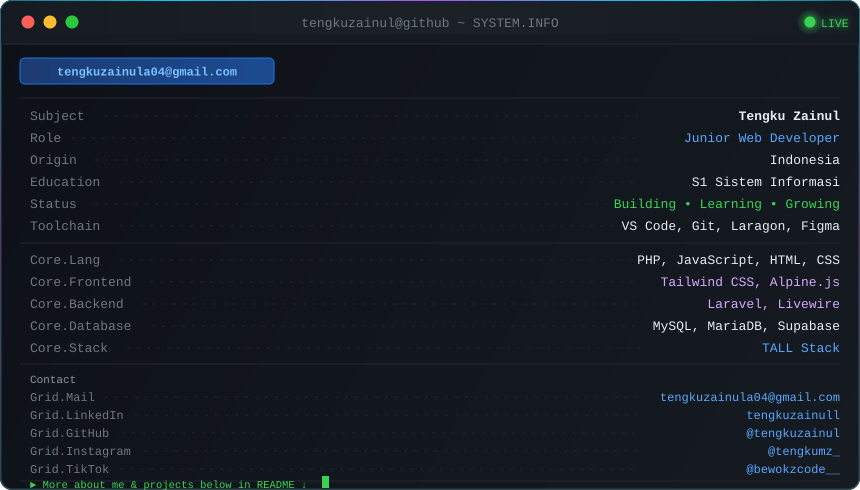
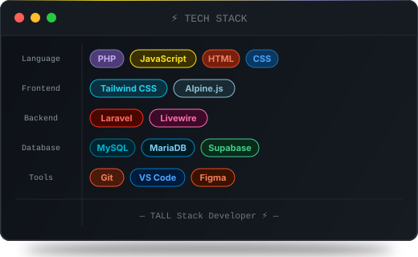
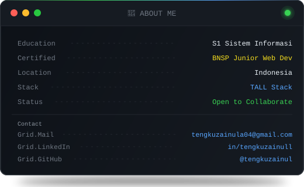

<!-- ═══════════════════════════════════════════════════════════ -->
<!--              TENGKU ZAINUL — GITHUB PROFILE               -->
<!--              Bento Grid Layout · 3D Card Edition          -->
<!-- ═══════════════════════════════════════════════════════════ -->

 

<!-- ╔══════════════════════════════════════════════════════════╗ -->
<!-- ║  BENTO ROW 1 — Terminal ID Card (Full Width)            ║ -->
<!-- ╚══════════════════════════════════════════════════════════╝ -->

  

 

<!-- ╔══════════════════════════════════════════════════════════╗ -->
<!-- ║  BENTO ROW 2 — Tech Stack · About Me (50 / 50)         ║ -->
<!-- ╚══════════════════════════════════════════════════════════╝ -->

<table width="100%" border="0" cellspacing="0" cellpadding="4">
  <tr>
    <td width="50%" align="center" valign="top">
      
    </td>
    <td width="50%" align="center" valign="top">
      
    </td>
  </tr>
</table>

 

<!-- ╔══════════════════════════════════════════════════════════╗ -->
<!-- ║  BENTO ROW 3 — GitHub Stats · Top Languages (55 / 45)  ║ -->
<!-- ╚══════════════════════════════════════════════════════════╝ -->

<table width="100%" border="0" cellspacing="0" cellpadding="4">
  <tr>
    <td width="55%" align="center" valign="top">
      
    </td>
    <td width="45%" align="center" valign="top">
      
    </td>
  </tr>
</table>

 

<!-- ╔══════════════════════════════════════════════════════════╗ -->
<!-- ║  BENTO ROW 4 — GitHub Streak (Full Width)              ║ -->
<!-- ╚══════════════════════════════════════════════════════════╝ -->

  

 

<!-- ╔══════════════════════════════════════════════════════════╗ -->
<!-- ║  BENTO ROW 5 — Contribution Activity (Full Width)      ║ -->
<!-- ╚══════════════════════════════════════════════════════════╝ -->

  

---

<!-- ╔══════════════════════════════════════════════════════════╗ -->
<!-- ║  CONNECT — Social Media & Certification                 ║ -->
<!-- ╚══════════════════════════════════════════════════════════╝ -->

<h3 align="center">🌐 Connect With Me</h3>

---

<!-- ╔══════════════════════════════════════════════════════════╗ -->
<!-- ║  BENTO ROW 6 — Snake Contribution Graph (Full Width)   ║ -->
<!-- ╚══════════════════════════════════════════════════════════╝ -->

<h3 align="center">🐍 Snake Eating My Contributions</h3>

  <picture>
    <source media="(prefers-color-scheme: dark)"  srcset="https://raw.githubusercontent.com/tengkuzainul/tengkuzainul/output/snake-dark.svg">
    <source media="(prefers-color-scheme: light)" srcset="https://raw.githubusercontent.com/tengkuzainul/tengkuzainul/output/snake.svg">
    
  </picture>

---

  

