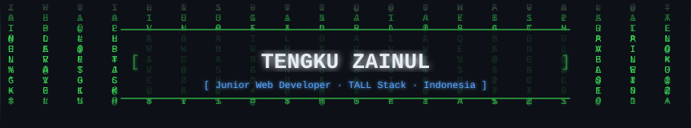
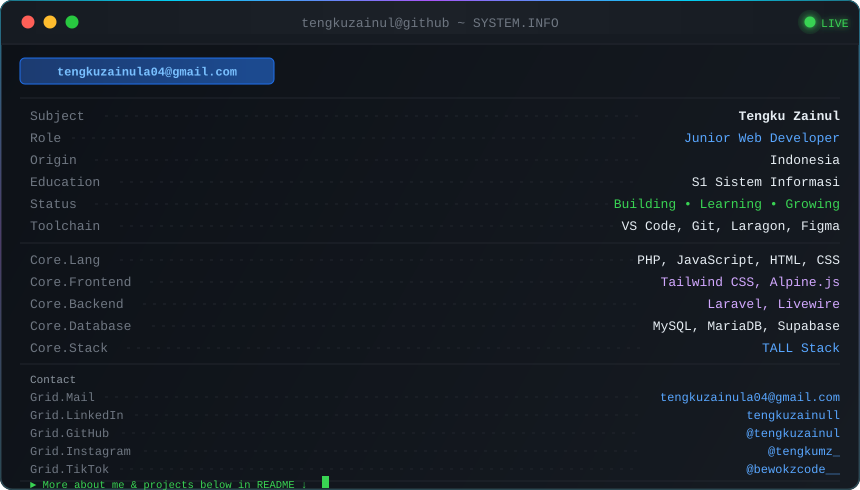
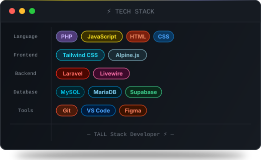
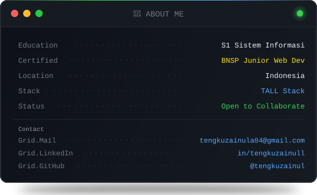

<!-- ═══════════════════════════════════════════════════════════ -->
<!--              TENGKU ZAINUL — GITHUB PROFILE               -->
<!-- ═══════════════════════════════════════════════════════════ -->

 

<!-- BADGES ROW 1: Socials -->

 

<!-- BADGES ROW 2: Tech Stack -->

 

<!-- BADGES ROW 3: Stats -->

  

<!-- ═══════════════════════════════════════════════════════════ -->
<!--                  DETAILS & STATS (ACCORDION)              -->
<!-- ═══════════════════════════════════════════════════════════ -->

<b>▶ Click for GitHub Stats & Bento Details</b>

 

  

 

 

<table width="100%" border="0" cellspacing="0" cellpadding="4">
<tr>
<td width="50%" align="center" valign="top"></td>
<td width="50%" align="center" valign="top"></td>
</tr>
</table>
 

<table width="100%" border="0" cellspacing="0" cellpadding="4">
<tr>
<td align="center" width="50%">

</td>
<td align="center" width="50%">

</td>
</tr>
</table>
 

 

 

<b>▶ Click for Contribution Snake</b>

 

<picture>
<source media="(prefers-color-scheme: dark)"  srcset="https://raw.githubusercontent.com/tengkuzainul/tengkuzainul/output/snake-dark.svg">
<source media="(prefers-color-scheme: light)" srcset="https://raw.githubusercontent.com/tengkuzainul/tengkuzainul/output/snake.svg">

</picture>

 

<!-- ═══════════════════════════════════════════════════════════ -->
<!--                  FAVORITE OPEN SOURCE REPOS                 -->
<!-- ═══════════════════════════════════════════════════════════ -->

<b>▶ Favorite Open Source Repositories</b>

 
<table width="100%" border="0" cellspacing="0" cellpadding="4">
<tr>
<td width="50%" align="center">

</td>
<td width="50%" align="center">

</td>
</tr>
<tr>
<td width="50%" align="center">

</td>
<td width="50%" align="center">

</td>
</tr>
</table>

<i>(Note: If the repository cards above appear broken, it is because the <code>github-readme-stats.vercel.app</code> server is temporarily down.)</i>

