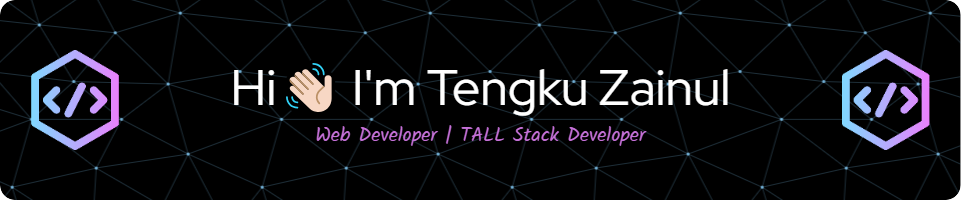

- 🎓 I'm currently **Undergraduate Information System**
- 🏅 I'm Associate **Junior Web Developer** by [_BNSP_](https://drive.google.com/file/d/1PW3DAM6kb_gNTIj6ifjzH39ttv2XhWwg/view?usp=sharing)
- **</>** The Tech Stack I am currently using is [**TALL**](https://tallstack.dev/)

---

**<h1 align="center">SOCIAL MEDIA</h1>**

          <a href="https://www.instagram.com/tengkumz_">
                                                            
                                </a>
                                <a href="https://www.linkedin.com/in/tengkuzainull">
                                                            
                                </a>
                                <a href="https://www.tiktok.com/@bewokzcode__">
                                                            
                                </a>
                                <a href="mailto:tengkuzainula04@gmail.com">
                                                            
                                </a>

---

## Skills

            
